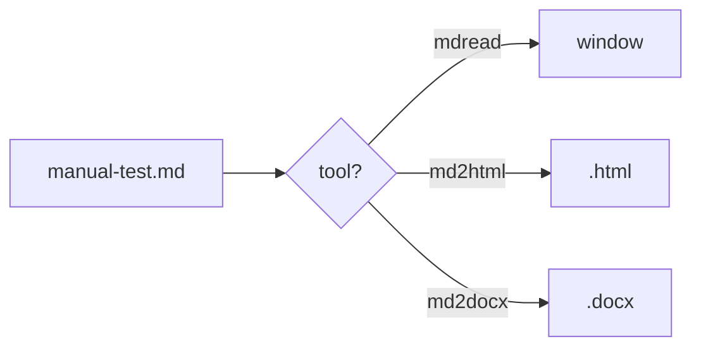

# md-files manual test page

Every feature of the suite on one page. Open this file with each tool and
compare against the checklist in the README.

## Text basics

**Bold**, *italic*, ~~strikethrough~~, `inline code`, and a footnote[^1].

[^1]: The footnote text appears at the bottom of the page.

## Task list

- [x] Rendered as a checked box
- [ ] Rendered as an unchecked box

## Table

| Tool    | Input    | Output |
|---------|----------|--------|
| mdread  | .md      | window |
| md2html | .md      | .html  |
| md2docx | .md      | .docx  |

## Code block (should be syntax-colored)

```rust
fn main() {
    let greeting = "hello from md-files";
    println!("{greeting}");
}
```

## Mermaid diagram (should draw as a flowchart, not code)



## Local image (should display a colored rectangle)


## Links

- Internal: [open the linked page](linked-page.md) — in mdread this should
  navigate in-window and mouse **Back** should return here.
- External: [example.com](https://example.com) — in mdread this should open
  in your default browser, not in the viewer.

> A blockquote, to round things off.

---

*End of test page.*
